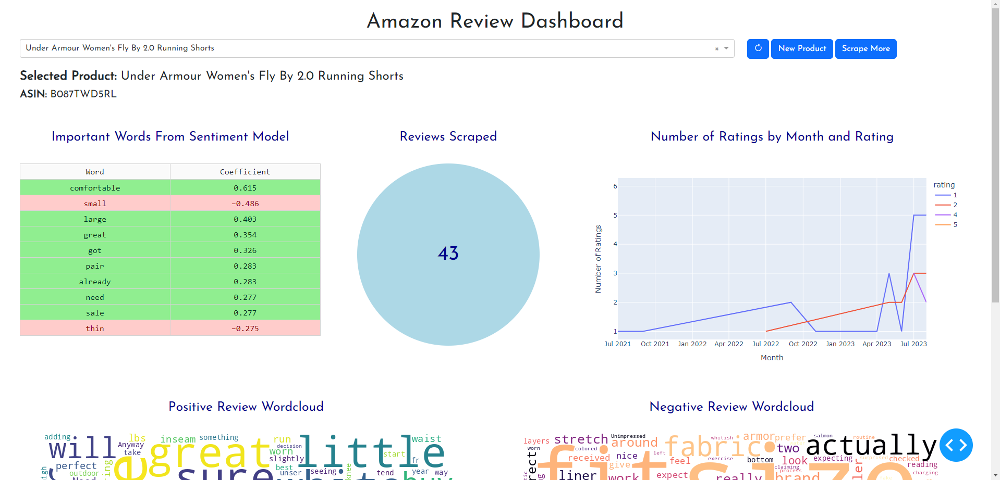
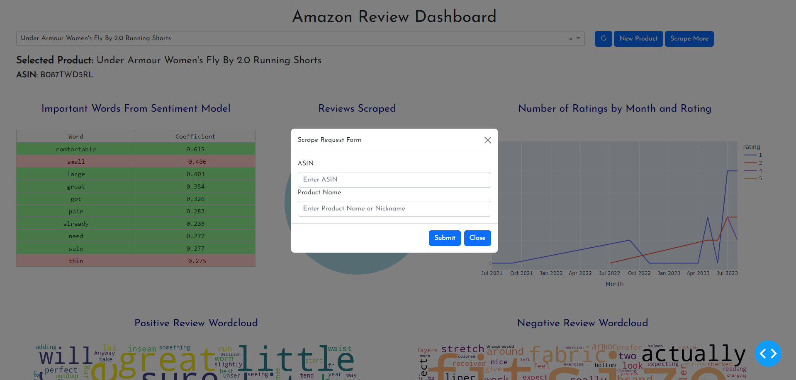

# Amazon Review Scraper and Dashboard

A dashboard and scraping web app made for Amazon sellers to quickly identify products to sell and features to market.

<details>
<summary>Table of Contents</summary>

- [Project Overview](#project-overview)
- [Quickstart Guide](#quickstart-guide)
  - [Windows](#windows-setup)
  - [MacOS/Linux](#macos-and-linux-setup)
- [More Details](#more-details)
- [Credits](#credits)

</details>

## Project Overview

This app consists of two main pieces. The frontend dashboard built with the Python library Dash and a backend REST API built with flask

### The Frontend



The dashboard displays feature importances from a sentiment model trained on the selected product's reviews. This tells us which words are specifically contributing to a review being classified as negative or positive. It also features graphics to display the number of reviews scraped for this product and the number of reviews over time grouped by the rating. The bottom half of the dashboard shows two wordclouds created by subsetting the data by positive and negative reviews. The larger the word, the more prevalent it is in those type of reviews. Combined, these figures help to identify pain points and pleasure points in the selected product.

The frontend also features buttons which make it easy to request a new product to be scraped or to scrape additional reviews for the selected product. By submitting these forms, you make a request to the backend REST API that starts a scraping task.



### The Backend

The backend is a REST API created with Flask. Its most important endpoint is used to start a web scraper that scrapes Amazon product reviews for the requested product. The scraper features a pipeline that parses and sends the data to a MySQL database table. When the scraping is completed, another pipeline is triggered that creates the wordclouds and sentiment models for the selected product and pushes the results to an AWS S3 bucket.

## Quickstart Guide

Before starting, clone the repository locally.

### 1.) Database Setup

The first step is to setup a MySQL database. Note the database name, host, the mmaster user, the password. I used AWS RDS to host mine (see setup [here](https://docs.aws.amazon.com/AmazonRDS/latest/UserGuide/CHAP_Tutorials.WebServerDB.CreateDBInstance.html)) but a locally hosted MySQL database should work too. If using AWS RDS, make sure to set `Publically accessible` to Yes.

### 2.) AWS S3 Bucket Setup

You will need to setup an AWS S3 bucket to hold the wordclouds and the results from the sentiment model. You can see a guide [here](https://docs.aws.amazon.com/AmazonS3/latest/userguide/creating-bucket.html). Make sure to name the bucket `amazon-product-analysis-objects` and make objects can be public. Also note the regions the bucket is in, your AWS Access Key and AWS Secret Access Key. For help with this go [here](https://aws.amazon.com/blogs/security/wheres-my-secret-access-key/).

### 3.) Scrapeops Setup

Next, you need to setup an account with Scrapeops. The scraper is built with their package Scrapy and they provide a proxy service for scraping. There free tier allows 1000 pages to be scraped which should be good for a decent amount of products but you can upgrade to a paid plan if needed. Sign up for an account [here](https://scrapeops.io/app/register/main) and find the Account API Key in the Settings tab.

### 4.) Secrets Configuration

You will need to create 2 files to keep passwords and secrets hidden. One will use a `.env` file to store database information and the other will be a python file called `mysecrets.py`. Both are in the `.gitignore` file and will be ignored by source control and keeps them relatively secure.

You will create the `.env` file in the `amazon-python-scrapy-scraper/` directory and fill in the following replacing with your secrets:

```env
# amazon-python-scrapy-scraper/.env

SCRAPE_OPS_API_KEY='scrapeops_api_key'

# database secrets-
MYSQL_HOST='mysql_database_host'
MSQL_DATABASE='mysql_database_name'
MYSQL_PASSWORD='mysql_database_password'


# aws keys
AWS_ACCESS_KEY_ID=aws_access_key
AWS_DEFAULT_REGION=aws_region
AWS_BUCKET_ACCESS_KEY=aws_secret_access_key
AWS_BUCKET_NAME=your-bucket-name
```

Create `.env` in the `amazon-reviews-dashboard/` directory and replace with your secrets.

```env
# amazon-review-dashboard/.env

SCRAPE_OPS_API_KEY='your-scrapeops-api-key'

# database secrets-
MYSQL_HOST='your-mysql-db-host'
MSQL_DATABASE='your-db-name'
MYSQL_PASSWORD='your-db-password'
MYSQL_USER='your-db-user'


# aws keys
AWS_ACCESS_KEY_ID=aws-access-key
AWS_BUCKET_REGION=aws-region
AWS_SECRET_ACCESS_KEY=aws-secret-access-key
AWS_BUCKET_NAME=s3-bucket-name

```

Now we need to open 3 terminals. One to run the backend REST API, another to serve the dashboard and a third as a worker in a task queue that actually handles the scraping (multiple can be opened and run to scrape multiple at a time). These steps will vary slightly between OS's

### Windows Startup

#### REST API

Open a command prompt and run the following commands to start the API

```bash
cd amazon-python-scrapy-scraper
python -m venv venv
venv\Scripts\activate
pip install -r requirements.txt
python app.py

```

#### Worker Terminal

The task queue uses Redis Queue, which isn't available on Windows so you have to install Windows Subsystem for Linux (WSL) and open an Ubuntu terminal using that. You can install WSL [here](https://learn.microsoft.com/en-us/windows/wsl/install) and to open an Ubuntu terminal in VS Code you need to close an reopen the application. When you open the terminal and click on the plus symbol, there should be a WSL option.

After setting up WSL and opening a WSL terminal, run the following:

```bash
cd amazon-python-scrapy-scraper
python3 -m venv worker-venv
source worker-venv/bin/activate
pip3 install -r requirements.txt
sudo service redis-server start
rq worker
```

This sets up the virtual environment, starts the task queue and opens a worker on this queue.

#### Dashboard Setup

Now to open the Dash Dashboard. Open a Command Prompt window and run the following:

```bash
cd amazon-review-dashboard
python -m venv dashboard-venv
dashboard-venv\Scripts\activate
pip install -r requirements.txt
python app.py

```

The dashboard will be running on http://127.0.0.1:8050/

### MacOS and Linux Startup

Setup on MacOS will be really similar but some of the commands to activate the virtual environments will differ slightly. Open up 3 terminals and run the following. It might take awhile to install the dependencies.

#### REST API

Open a command prompt and run the following commands one at a time to start the API

```bash
cd amazon-python-scrapy-scraper
python3 -m venv venv
source venv/bin/activate
pip3 install -r requirements.txt
python3 app.py

```

#### Worker Terminal

```bash
cd amazon-python-scrapy-scraper
python3 -m venv worker-venv
source worker-venv/bin/activate
pip3 install -r requirements.txt
sudo service redis-server start
rq worker
```

This sets up the virtual environment, starts the task queue and opens a worker on this queue.

#### Dashboard Setup

Now to open the Dash Dashboard. Open a Command Prompt window and run the following:

```bash
cd amazon-review-dashboard
python3 -m venv dashboard-venv
source dashboard-venv/bin/activate
pip3 install -r requirements.txt
python3 app.py

```

This creates and activates a virtual environment for the dashboard, installs the dependencies and then starts the dashboard

## More Details

The scraper was built on a fork of a repository made by Scrapeops. I edited the spider to parse what I wanted from the reviews. I also had to add a feature to change the review sorting option. Amazon limits products to 10 pages of reviews per sort whihc severly limited the amount of reviews I was able to scrape. To get around this I would change the url to a different sort (1 star reviews, featured reviews, ...) every 10 pages to maximize the number of reivews scraped. I also created the pipeline that sent the parsed data to a MySQL databse as it is being scraped and the pipeline that ran the data science workflows upon completion of the scraping.

## Credits

The inital spider was forked from this [python-scrapy-playbook](https://github.com/python-scrapy-playbook/amazon-python-scrapy-scraper) repository.
